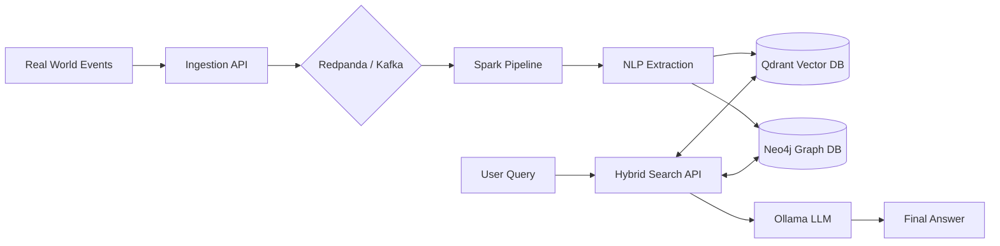

# Big Data RAG

[]()
[]()
[]()

**An autonomous intelligence substrate integrating streaming data, knowledge graphs, and vector databases to create a living, updating digital brain.**

This project implements a scalable Retrieval-Augmented Generation (RAG) system that doesn't just "read" documents but "experiences" events in real-time, building a structured memory graph alongside semantic vector embeddings.

## 🚀 Key Features

- **Real-Time Ingestion**: Stream events via Kafka/Redpanda.
- **Hybrid Memory**: Combines **Vector Search** (Qdrant) for semantics with **Knowledge Graph** (Neo4j) for relationships.
- **Autonomous Processing**: Distributed pipelines (Apache Spark) transform raw events into knowledge.
- **Local LLM Inference**: Privacy-first AI using Ollama (LLaMA 3, DeepSeek, etc.).
- **Observable**: Full monitoring with Prometheus and custom metrics.

## 🏗️ Architecture

The system follows a clean architecture pattern:



See [ARCHITECTURE.md](docs/ARCHITECTURE.md) for deep dive.

## 🏁 Quick Start

### Prerequisites
- Docker & Docker Compose
- Python 3.11+

### 1. Start Infrastructure
```bash
cd docker
docker-compose up -d
```
*Starts Redpanda, Qdrant, Neo4j, Airflow, and Postgres.*

### 2. Install Dependencies
```bash
# Root directory
pip install -r requirements.txt
```

### 3. Run the API
```bash
# Start the FastAPI server
python run.py api
```
*Access Swagger Docs at http://localhost:8000/docs*

## 📚 Documentation

- **[Setup Guide](docs/guides/SETUP.md)**: Detailed installation and environment configuration.
- **[Usage Guide](docs/guides/USAGE.md)**: How to ingest data, manage memory, and ask questions.
- **[Architecture](docs/ARCHITECTURE.md)**: System design and component interaction.
- **[Developer Guide](DEVELOPER.md)**: Coding standards and contribution workflow.

## 🛠️ Stack

| Component | Technology |
|-----------|------------|
| **API** | FastAPI |
| **Stream** | Redpanda (Kafka) |
| **Vector DB** | Qdrant |
| **Graph DB** | Neo4j |
| **Processing** | Apache Spark |
| **LLM** | Ollama |
| **Orchestration**| Airflow |

## 🤝 Contributing

See [DEVELOPER.md](DEVELOPER.md) for guidelines on how to contribute.

## 📄 License

MIT